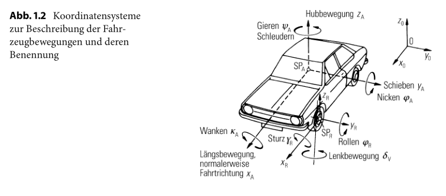

# 汽车动力学

## 汽车动力学问题概述

一部四轮车辆可以简单地认为由五个质量（车身和车轮质量）组成，他们通过悬架的导向装置、弹簧和减震器联系在一起。每一个刚体都有六个自由度，整车就有三十个自由度。描写这样的系统的运动就需要相应的微分方程，但是微分方程之间是相互关联而不是完全独立的。

而实际上，对于车辆而言其驱动装置（发动机、变速箱、主减速器等），车内乘员、传动轴、转向系的运动可能性都可以导致运动自由度数目的增加。

在实际的研究中，我们将整个问题分割为多个局部问题进行考虑，并相应做了一些忽略。

实际上，在当前还没实现自动驾驶的情况下，驾驶员控制着车速和方向，其活动会通过制动、加速和转向等操作反作用到车辆上，而车辆往往不能直接反应，从而需要进行控制。

## 局部问题的划分

   

车辆的固定坐标系中，车声绕着 $$x_A$$ 轴 的运动称为侧倾运动，绕着 $$y_A$$ 轴的转动称为俯仰运动，绕着 $$z_A$$ 轴的转动称为横摆运动。

车辆直线行驶时，我们主要关注行驶阻力、行驶功率以及制动和加速过程。

侧偏运动和横摆运动均导致对于行驶方向的偏离，主要属于操纵稳定性的问题。

而在表面不平整的道路上出现的车辆沿着铅垂轴的跳动和俯仰和侧倾，也是操纵稳定性的内容。

