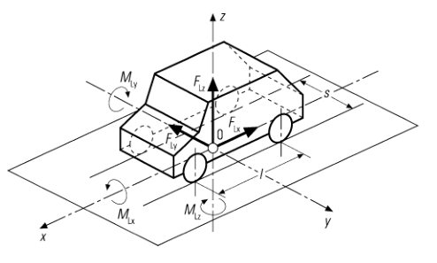
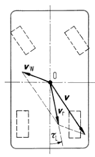
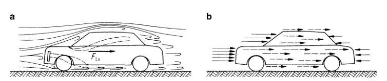
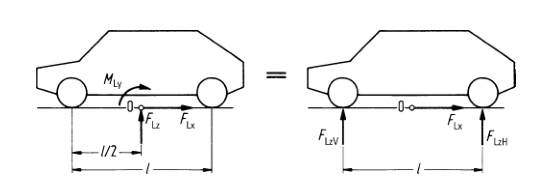
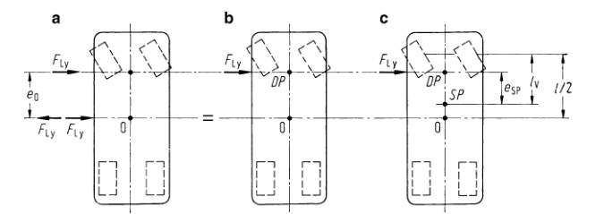

# 车辆空气动力学

## 空气阻力和力矩

空气阻力：

$$
a = bF_{\mathrm{Lx}}=c_{\mathrm{x}} A \frac{\rho}{2} \mathrm{v}_{\mathrm{r}}^{2}
$$

侧向空气作用力：

$$
F_{\mathrm{Ly}}=c_{\mathrm{y}} A \frac{\rho}{2} \mathrm{v}_{\mathrm{r}}^{2}
$$

空气升力：

$$
F_{\mathrm{Lz}}=c_{\mathrm{z}} A \frac{\rho}{2} \mathrm{v}_{\mathrm{r}}^{2}
$$

空气侧倾力矩：

$$
M_{\mathrm{Lx}}=c_{\mathrm{Mx}} l A \frac{\rho}{2} \mathrm{v}_{\mathrm{r}}^{2}
$$

空气俯仰力矩：

$$
M_{\mathrm{Ly}}=c_{\mathrm{My}} l A \frac{\rho}{2} \mathrm{v}_{\mathrm{r}}^{2}
$$

空气横摆力矩：

$$
M_{\mathrm{Lz}}=c_{\mathrm{Mz}} l A \frac{\rho}{2} \mathrm{v}_{\mathrm{r}}^{2}
$$

### 流入速度和流入角、空气密度

气流流入合成速度是由车辆穿过静止空气的速度的负值 v 和气流速度 $$v_w$$ 构成的，其中流入角是指流入速度和纵轴线的夹角。

### 迎风面积

轿车的迎风面积和车辆的空载质量有关

### 空气阻力、空气阻力系数

占主要地位的外部气流损失是由压力阻力（形状阻力，因为车辆的迎面压力大于后部压力）和摩擦阻力（即表面阻力，是在汽车与切向气流摩擦表面上产生的）构成

空气阻力以及相应的空气阻力系数是与流入角有关系的，与没有圆角的物体相比，端面有圆角的物体可以使得空气阻力大为降低。

### 空气升力 扰流罩

空气升力和空气俯仰力矩对于高速轿车而言，总是使得前轴和后轴的轴荷减小，将会影响汽车的行驶特性。

前轴的升力和后轴的升力可以看到：

$$
F_{\mathrm{LzV}}=c_{\mathrm{zV}} A \frac{\rho}{2} \mathrm{v}_{\mathrm{r}}^{2}=\frac{1}{2}\left(F_{\mathrm{Lz}}+\frac{M_{\mathrm{Ly}}}{l}\right)
$$

$$
F_{\mathrm{L} z \mathrm{H}}=c_{\mathrm{zH}} A \frac{\rho}{2} \mathrm{v}_{\mathrm{r}}^{2}=\frac{1}{2}\left(F_{\mathrm{Lz}}-\frac{M_{\mathrm{Ly}}}{l}\right)
$$

对于高速行驶的车辆而言，其稳态轴荷总是在减小，并且前轴减小的程度大于后轴，当有侧向风的时候，空气升力增加的幅度更加显著。

一般情况下，在减小升力系数的同事，空气阻力系数将上升。前扰流罩减小了车辆底部气流通过的面积，由此使得车速提高和负压增加，这样使得车轮全部升力有效降低。作为安装在行李舱盖上的后扰流罩的尾翼产生一个向下的压力，使得后轴的升力减小，甚至产生负升力。值得注意的，比较小的前扰流罩对后轴的升力系数几乎没有影响，比较小的尾翼对升力系数也几乎没有影响，但是将使得空气阻力系数减小。

### 侧向风 压力中心

