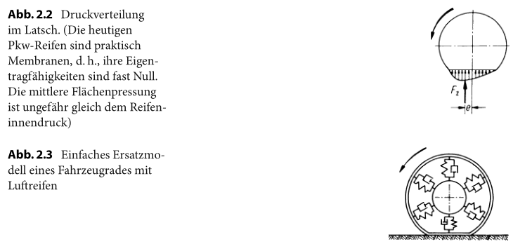
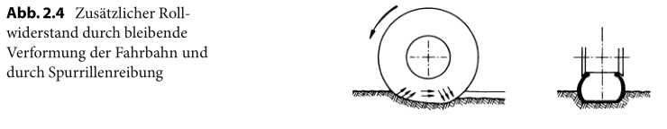
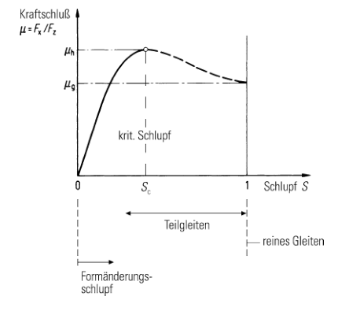

# 轮胎

## 轮胎的切向特性

关于轮胎的切向特性可以分为滚动阻力、可以传递的最大驱动力和制动力以及附着和滑移的问题。

### 车轮阻力

 

#### 滚动阻力

由试验结果可以知道，滚动阻力主要和车轮载荷有关，并且近似是线性关系：

$$F_R = f_R F_z $$ 

其中比例系数 $$f_R$$ 称为滚动阻力系数

按照图1中由于车轮轴线的扭矩是平衡的，当 $$M_R = 0$$ 时，有下式成立：

$$M_y - F_x r = 0$$ 

将 $$M_y$$ 作为力偶考虑有

$$M_y = F_z e$$ 

综合得到

$$F_R = f_R F_z = \frac{e}{r} F_z$$ 

这一结果表明，纵向载荷作用于轮胎接地印记面中心的前侧，沿着接地印记面长度方向的压力分布是不对称的，如图2所示。

 

上图右侧是一个简单的轮胎模型，可以用于解释滚动阻力是怎么样产生的。胎面用圆周箍圈代替，胎壁用单元弹簧和减震器来代替。进入轮胎接地印记时，箍圈从圆弧压缩成直线被压粗，单元弹簧和减震器受到压缩。从接地印记脱开时u，又恢复原状，但是这个过程是有能量损耗的，这种能量的损耗就来源于滚动阻力，可以发现，如果：

* 轮胎的材料阻尼越小
* 轮胎的压缩量越小

则滚动阻力就越小。

在松软的路面行驶时，还要考虑到轮胎陷进路面，而路面形成轮辙；同时轮胎胎壁还受到附加的摩擦力，如图3所示，所以在松软路面行驶的滚动阻力要和硬路面相比显著增大。

 

在平整硬路面上，随着车速的提高，滚动阻力系数也随之增加，如图4所示。在轮胎高速行驶时滚动阻力的递增是由于在轮胎上形成了驻波，其会导致轮胎的温度大幅提升，从而限制了最高车速。对于轿车轮胎有近似关系：

 $$f{\mathrm{R}}=f{\mathrm{R} 0}+f{\mathrm{R} 1}\left(\frac{\mathrm{v}}{100 \mathrm{km} / \mathrm{h}}\right)+f{\mathrm{R} 4}\left(\frac{\mathrm{v}}{100 \mathrm{km} / \mathrm{h}}\right)^{4} $$ 

而轮胎气压提高后，轮胎的接地印记的面积减小了，因而轮胎的变形就减小了。

#### 穿水阻力

在湿路面上，由于车轮必须排挤水层所以其滚动阻力增大，这部分增量称为穿水阻力，和行驶速度和由轮胎宽度于水层厚度形成的面积有关。

#### 轴摩擦、残余制动力矩

#### 车轮的其他阻力

一辆车的车轮可能是不平行的，在直线行驶的汽车上，前轮前束是我们要求的行驶状态（见图5），由于前束角的存在，滚动时所产生的偏离会产生侧向力，其纵向分力和行驶方向相反于是就形成了前束阻力。

一般而言，前束阻力的数量级是滚动阻力1/10，而在前后轴载荷平均分配的情况下，后轮没有偏离，一般仅为1/20。

还有一部分阻力是因为在不平路面上的行驶产生的，此时的车辆振动是的轮胎进一步产生动态压缩，使得滚动阻力增加。

#### 总的车轮阻力

在干燥路面行驶时，即使存在残余扭矩，车轮阻力也实际上等于滚动阻力。

### 切向附着、滑移

车轮切向力

$$F_{\mathrm{x}}=\frac{M_{\mathrm{R}}}{r}-F_{\mathrm{z}} \frac{e}{r}=\frac{M_{\mathrm{R}}}{r}-F_{\mathrm{R}}$$ 

上式说明，驱动力必须要克服滚动阻力，剩余部分才能用于车辆前进运动；制动时，滚动阻力和制动力是一致的。

 

轮胎和路面之间可以传递的切向力是有限的，其最大值

$$F_{xmax} = \mu_b F_z$$ 

其中的系数称为附着系数（最大附着系数）。

引入滑移率的概念，定义为两个相对角速度之差除以其中较大的角速度，同时把切向力除以轮荷定义为附着率

$$\mu=\left|F_{\mathrm{x}}-F_{\mathrm{R}}\right| / F_{\mathrm{z}} = F_x / F_z$$ 

（滚动阻力总是很小，可以忽略）

附着率是滑移率的函数，如图7所示

 

不同的路面上其附着特性也是不同的

 

* 在湿路面上的轮胎不再是整个接地印记传递切向力，而仅仅是接地印记的后部。水层厚度和行驶速度越大，单位时间内要排开的水量就越大，而被轮胎花纹排出的水量就越小。如果进入大于排出的水量，那么轮胎就会浮起，其附着就会趋于零，即产生所谓滑水现象。
* 在潮湿的冰面上附着最低，随着温度降低有所上升，这时可以采取附加咬合的方法。

 

## 轮胎的垂直特性

车轮载荷由静载荷和动载荷（如通过不平路面）组成：

$$F_z = F_{zstat} + F_{zdyn}(t)$$ 

### 接地印记面的压力分布

图10中看出，子午线轮胎的压力在整个印记面上基本保持一致，这样可以使得附着系数有着较高的水平。

随着车轮载荷的增加，接地印记面的面积不断增加。由于子午线轮胎的接地印记的宽度变化很小，所以载荷的增加主要引起接地印记长度的增加。

 

### 轮胎弹性和阻尼

车辆振动中需要考虑轮胎的垂直振动特性，其频率范围为 0~25 Hz ，而轮胎的固有频率远高于这个范围，此处可以忽略轮胎质量，仅仅作为一个弹簧-减震器模型进行讨论。

$$\hat{\underline{F}}_{z} \approx c\left(1+j \frac{k \omega}{c}\right) \hat{\underline{z}}=c(1+j \mathrm{d}) \hat{\underline{z}}$$ 

 

## 轮胎的侧向特性

### 侧向力、回正力矩、侧偏角

车辆和车轮之间的侧向作用力Y以及其引起的反力，即轮胎与道路之间的侧向力 $$F_y$$ ，使得车轮不再沿着 $$x_R$$ 方向滚动，而偏向一侧。其中速度 $$v_R$$ 和 $$x_R$$ 方向之间的夹角称为侧偏角。

 

可以用侧向力随着侧偏角的变化来表示轮胎侧偏特性，其中使用轮荷 $$F_z$$ 作为参变量。

侧向作用力不仅引起了侧向力F，还产生了回正力矩 $$M_z$$ ，这一力矩的存在表明侧向力不是作用在接地印记的中心。相应地，侧向力作用在接地印记中心的后侧，其作用点和中心的距离称为轮胎拖距，其数值可以用下式求得：

$$
\frac{M_z}{F_y} = \frac{F_y n_R}{F_y} = n_R
$$

#### 对侧偏特性的理解

假定轮胎轴不动，而路面是动的，并用一个很大的转鼓来代替，把轮胎对于转鼓方向扭过的角度称为 $$\alpha$$ 。

单元弹簧中的合力是作用在接地印记面中心的后面的，在侧偏角较小时，只要成立“接地印记上点不滑动”和“单元弹簧是线性的”这两个假设，侧向变形图就总是一个三角形，所以其作用点保持不变，即轮胎脱距

$$
n_R = const
$$

因而，回正力矩在侧偏角较小时总是线性增加的

### 车轮外倾的影响

如果车轮和路面之间有侧倾角 $$\gamma$$ ，那么在侧向力相等的情况下，具有正外倾的车轮侧偏角变大，而侧倾角不变时回正力矩将随着正外倾角的增大而增大。

### 切向力对于轮胎特性的影响

如果车辆没有滑动而处于滚动状态时，车轮同时受到切向力和侧向力的作用，其矢量和不应该超过 $$\mu_hF_z$$ ，如果大于就出现滑移，小于就是滚动

### 轮胎模型

轮胎模型的缺点是为了进行特性曲线的计算还需知道一些常数的大小，一般而言侧向力-侧偏角曲线符合的比较好，但是回正力矩却不理想。

### 轮胎的导入特性

之前的描述都是基于稳态的，而在动态的情况下，上述的曲线就不适应了。

