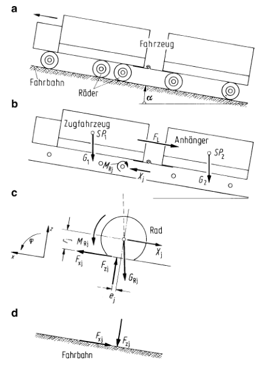

# 行驶阻力、功率需要

## 驱动的基本方程、牵引力

基本方程

$$
\sum_{j=1}^{n} \frac{M_{\mathrm{Rj}}}{r_{\mathrm{j}}}=\left(m+\sum_{j=1}^{n} \frac{J_{\mathrm{Rj}}}{r_{\mathrm{j}} R_{\mathrm{j}}}\right) \ddot{x}+G \sin \alpha+F_{\mathrm{Lx}}+\sum_{j=1}^{n} F_{\mathrm{zj}} \frac{e_{\mathrm{j}}}{r_{\mathrm{j}}}
$$

上面的方程中的右侧是四项阻力，称为：

滚动阻力：

$$
F_{\mathrm{R}}=\sum_{j=1}^{n} F_{2 j} \frac{e_{j}}{r_{j}}
$$

空气阻力：

$$
F_{Lx}
$$

上坡阻力：

$$
F_{\mathrm{St}}=G \sin \alpha
$$

加速阻力：

$$
F_{\mathrm{B}}=\left(m+\sum_{j=1}^{n} \frac{J_{\mathrm{Rj}}}{r_{\mathrm{j}} R_{\mathrm{j}}}\right) \ddot{x}
$$

左侧是驱动力矩之和被相应的静态轮胎半径，称为牵引力，得到了驱动了的基本方程：

$$
Z=F_{\mathrm{R}}+F_{\mathrm{Lx}}+F_{\mathrm{St}}+F_{\mathrm{B}}
$$

## 车辆的车轮阻力

